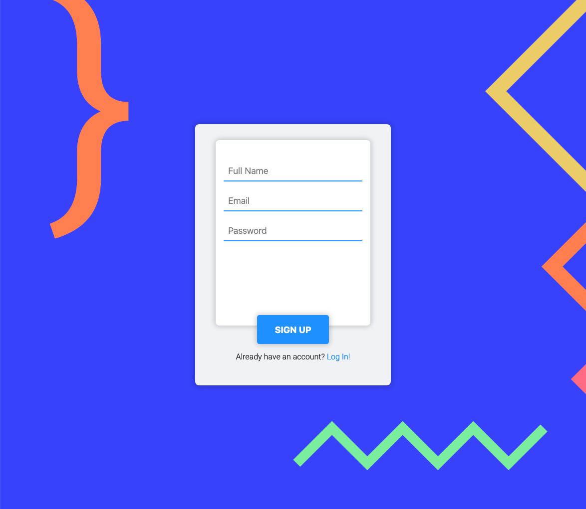

# 01 - Sign Up Screen

## Objective

- Create a sign up form
- Learn about forms in HTML
- Learn about CSS Styling of Forms

### Final Image

### Link to Final Project

[Live Site](https://mattbcowan.github.io/30-projects-30-days/01-sign-up/)

## Resources

[Visually Hidden Elements](https://www.a11yproject.com/posts/2013-01-11-how-to-hide-content/)
[MDN - How to Structure a Web Form](https://developer.mozilla.org/en-US/docs/Learn/Forms/How_to_structure_a_web_form)
[David França's CollectUI Submission (Reference)](https://collectui.com/designers/davidjnf/sign-up)
[FlatUI Chinese Palette (Colors)](https://flatuicolors.com/palette/cn)

## Process

I started off by finding a good [reference image](https://collectui.com/designers/davidjnf/sign-up) to base the project on. I really liked the simplicity of [David França's](https://dribbble.com/davidjnf) sign up page so I based mine off of that. I didn't want to spend much time designing my own when there's plenty of people out there that can design SIGNIFICANTLY better than me.

Next I laid out the HTML and looked into [how to structure web forms](https://developer.mozilla.org/en-US/docs/Learn/Forms/How_to_structure_a_web_form) so that they would be much more accessible. I started learning about accessibility recently and it's really grabbed my attention quite a bit. It makes sense that everyone should be able to use the web regardless of any personal issues you may deal with and I really want to strive to make my sites as accessible from a programming perspective as possible.

Now for the fun part. I added some basic CSS to get things organized and look... ugly but in their place. This was just for layout purposes so I used palevioletred and paleturquoise CSS default colors because... why not? It looked atrocious but it got the job done.

I decided to make a fun background in Figma and used the [FlatUI Chinese Palette](https://flatuicolors.com/palette/cn) for my colors. After importing the background I went ahead and changed the color of the elements to be in line with the color pallet I chose. After a few minor changes to text size and some hover effects I was done.

## What I Learned

I learned quite a bit about form accessibility along with the fact that I need to dive deeper than I thought with it. There's so much that goes into making a usable form and without it users wouldn't even be able to log in. It's kind of crazy to think that such a basic component of websites can be so complicated when you are trying to make it as accessible as you can. MDN helped quite a bit with their guide on structuring web forms and I'll definitely be reading through it further when I'm not rushing to get a project out.

## What I Need to Work On

My CSS knowledge needs some work. There was a lot of googling to make small changes such as box shadows. Accessibility as I've stated many times in this writeup is way below where I want it to be.
