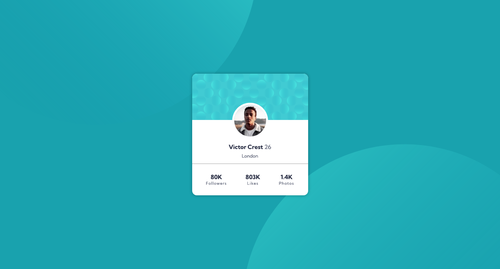
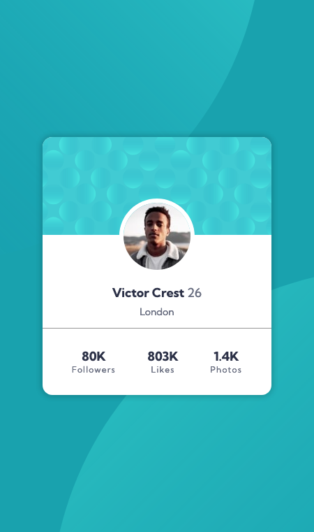

# Frontend Mentor - Profile card component solution

This is a solution to the [Profile card component challenge on Frontend Mentor](https://www.frontendmentor.io/challenges/profile-card-component-cfArpWshJ). Frontend Mentor challenges help you improve your coding skills by building realistic projects.

## Table of contents

- [Overview](#overview)
  - [The challenge](#the-challenge)
  - [Screenshot](#screenshot)
  - [Links](#links)
- [My process](#my-process)
  - [Built with](#built-with)
  - [What I learned](#what-i-learned)
  - [Continued development](#continued-development)
  - [Useful resources](#useful-resources)
- [Author](#author)

## Overview

### The challenge

- Build out the project to the designs provided

### Screenshot

### Links

- Live Site URL: [Under Construction](https://mattbcowan.github.io/30-projects-30-days/02-profile-card/)

## My process

Let's get started. First off, in yesterday's build I realized that I forgot to make ANY MEDIA QUERIES. I messed up. So today we are starting out mobile first. To begin I'm making a styles.css and adding in my initial styles from the style guide and my desktop media query.

After getting the styles set up I went in and adjusted the HTML to section things out. This is pretty standard for me with these Frontend Mentor projects. I added in the images from the image folder in their specific locations based on the provided designs.

Once the HTML was cleaned up it was time to work on the mobile version of the design. My main focus was the card itself. That's what I think will be the hardest part as the background is just setting the bubbles in the right places. I measured the card width based on the mobile design and made that the width for the mobile styles. After that I made everything flex components and adjusted the sizing of the text, weight of the text, spacing, etc. This will be standard even on the desktop version so I want to get this correct before moving forward. Once I have all of the text taken care of I moved on to the actual layout of all the components. The tricky one is the profile picture which I used negative margin on. Not sure if this is best practices but it worked.

Once the card was completed I moved on to the background. This wasn't too bad, mostly just tweaking the position of the bubbles.

Once the background was done it was time to move onto desktop styling. This was pretty straight forward. All I did was tweak a few numbers on the components and it was all good!

### Built with

- Semantic HTML5 markup
- CSS custom properties
- Flexbox
- Mobile-first workflow

### What I learned

I learned about some weird issues with flexbox and z-indexing. I'm not use to having to make backgrounds via multiple SVG's, normally I would just make the entire background and save 1 SVG but I can see where this would be useful. It is more work to get it working but it looks pretty nice at the end of the day.

### Continued development

I need to work on my skills with flexbox in general. I know enough to get 70-75% of the way to where I want to be but that little extra would be ideal. I also need to work on layering elements more. That took me the longest of anything just due to having to look up stuff on z-indexing. Overall, not a hard build but I did learn quite a bit.

### Useful resources

- [MDN - Z-Indexing](https://developer.mozilla.org/en-US/docs/Web/CSS/z-index) - This helped a ton for learning about how z-indexes work in order to get the background working.
- [CSS Tricks - Flexbox](https://css-tricks.com/snippets/css/a-guide-to-flexbox/) - I always have this open when I'm working with flexbox. It's a timesaver and I literally just open it before I start working.

## Author

- Website - [Matt Cowan](https://www.mattbcowan.com)
- Frontend Mentor - [@mattbcowan](https://www.frontendmentor.io/profile/mattbcowan)
- Twitter - [@mattbcowan](https://www.twitter.com/mattbcowan)
