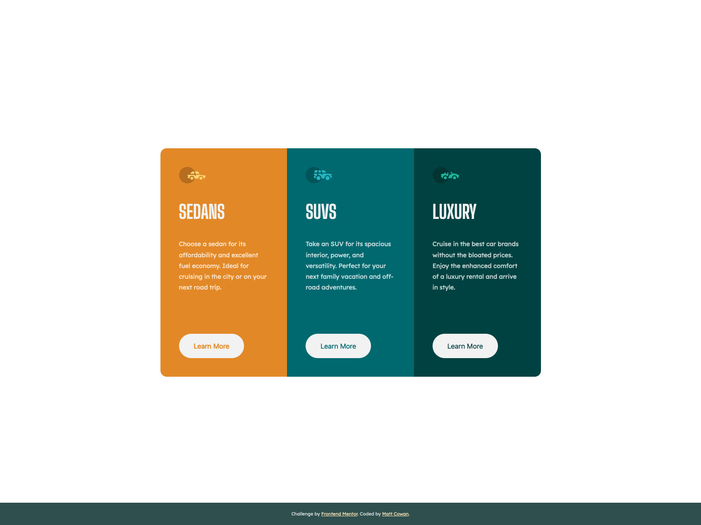

# Frontend Mentor - 3-column preview card component solution

This is a solution to the [3-column preview card component challenge on Frontend Mentor](https://www.frontendmentor.io/challenges/3column-preview-card-component-pH92eAR2-). Frontend Mentor challenges help you improve your coding skills by building realistic projects.

## Table of contents

- [Overview](#overview)
  - [The challenge](#the-challenge)
  - [Screenshot](#screenshot)
  - [Links](#links)
- [My process](#my-process)
  - [Built with](#built-with)
  - [What I learned](#what-i-learned)
  - [Continued development](#continued-development)
  - [Useful resources](#useful-resources)
- [Author](#author)

## Overview

### The challenge

Users should be able to:

- View the optimal layout depending on their device's screen size
- See hover states for interactive elements

### Screenshot

### Links

[Live Site](https://mattbcowan.github.io/30-projects-30-days/03-3-column-card/)

## My process

As always I start off with the basics. I make a styles.css, add in the media queries and colors from the style guide. I clean up the HTML and separate them out into sections so it will be easier to read. After this is where things change up a bit.

For this version I decided to go with CSS Grid mainly. 3 columns that are perfectly in order and equal seems like a perfect place to use grid over Flexbox. I got to work on the layout portion for the mobile version. After the layout was done I added in styling, put in the images, adjusted the font sizing and created the learn more buttons. Once all of that was done it was some simple spacing adjustments and the hover effects and I was done.

The desktop version was as simple as making it into a 3 column grid from a 1 column 3 row. I added the CSS styles for the grid to work correctly. I noticed the card was positioned close to the top rather than centered so I adjusted the container and main heights to be 100vh and added in a flex property to easily center the card on the page. Overall, this was a pretty simple build.

### Built with

- Semantic HTML5 markup
- CSS custom properties
- Flexbox
- CSS Grid
- Mobile-first workflow

### What I learned

I learned a few small things with CSS Grid. Mainly how finicky it can be to center items and how much easier it is with Flexbox when you aren't sure on your heights. I wasted some time trying to center with grid rows and stuff but in the end Flexbox was all of a few lines to center everything up.

### Continued development

I need to work on using grid more. I rely a ton on flexbox as that has been my main focus for so long. I'm just now getting into grid more and it's extremely powerful, I just don't know how to utilize it yet.

### Useful resources

- [CSS Tricks - Grid](https://css-tricks.com/snippets/css/complete-guide-grid/) - I always have either CSS Tricks grid or flexbox open. It's mandatory at this point in my workflow.

## Author

- Website - [Matt Cowan](https://www.mattbcowan.com)
- Frontend Mentor - [@mattbcowan](https://www.frontendmentor.io/profile/mattbcowan)
- Twitter - [@mattbcowan](https://www.twitter.com/mattbcowan)
