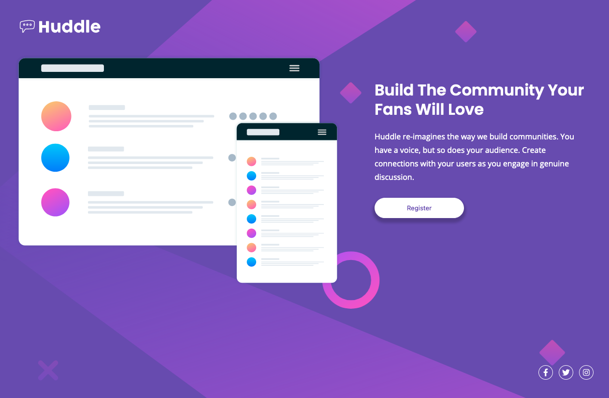

# Frontend Mentor - Huddle landing page with single introductory section solution

This is a solution to the [Huddle landing page with single introductory section challenge on Frontend Mentor](https://www.frontendmentor.io/challenges/huddle-landing-page-with-a-single-introductory-section-B_2Wvxgi0). Frontend Mentor challenges help you improve your coding skills by building realistic projects.

## Table of contents

- [Overview](#overview)
  - [The challenge](#the-challenge)
  - [Screenshot](#screenshot)
  - [Links](#links)
- [My process](#my-process)
  - [Built with](#built-with)
  - [What I learned](#what-i-learned)
  - [Continued development](#continued-development)
  - [Useful resources](#useful-resources)
- [Author](#author)

## Overview

### The challenge

Users should be able to:

- View the optimal layout for the page depending on their device's screen size
- See hover states for all interactive elements on the page

### Screenshot

### Links

- Solution URL: [Add solution URL here](https://your-solution-url.com)
- Live Site URL: [Add live site URL here](https://your-live-site-url.com)

## My process

I started off by opening the provided designs. I determined the different sections of the project and blocked them off in Figma. Once I had them determined I went into the HTML and separated the sections out so that it would be easier to read. After that I created a styles.css and imported it to the HTML along with the fonts and icons.

Once I had the HTML set up I added in some basic styling for the pieces in styles.css. Mobile layout was up first as I find it the easiest to start with. Once I had the basic styling down I went ahead and added in some hover effects to the buttons. That was it for the mobile layout.

I moved on to the desktop layout which was just shifting around some content via grid. I figured a 12 column grid would probably be best for this due to the odd spacing in the provided images. I went with that and adjusted the content to look as close as I could to the provided images and I was done.

### Built with

- Semantic HTML5 markup
- CSS custom properties
- Flexbox
- CSS Grid
- Mobile-first workflow

### What I learned

I learned a bit more about workflow with CSS Grid. I also learned a bit on using icons with FontAwesome. I've used them sparingly before but adding onto them with the circles around the icons was a new idea I hadn't really considered.

### Continued development

I need to learn more on scaling SVG's properly. This one wasn't too bad but they are definitely more complicated than just a PNG to place on a page.

### Useful resources

- [CSS Tricks - Grid](https://css-tricks.com/snippets/css/complete-guide-grid/) - I always have either CSS Grid or Flexbox from CSS Tricks open when I am making a full layout.

- [MDN Transitions](https://developer.mozilla.org/en-US/docs/Web/CSS/transition) - This was suggested to make things look a little smoother on hover and I really liked the outcome so I played with it a bit more in this project.

## Author

- Website - [Matt Cowan](https://www.mattbcowan.com)
- Frontend Mentor - [@mattbcowan](https://www.frontendmentor.io/profile/mattbcowan)
- Twitter - [@mattbcowan](https://www.twitter.com/mattbcowan)
